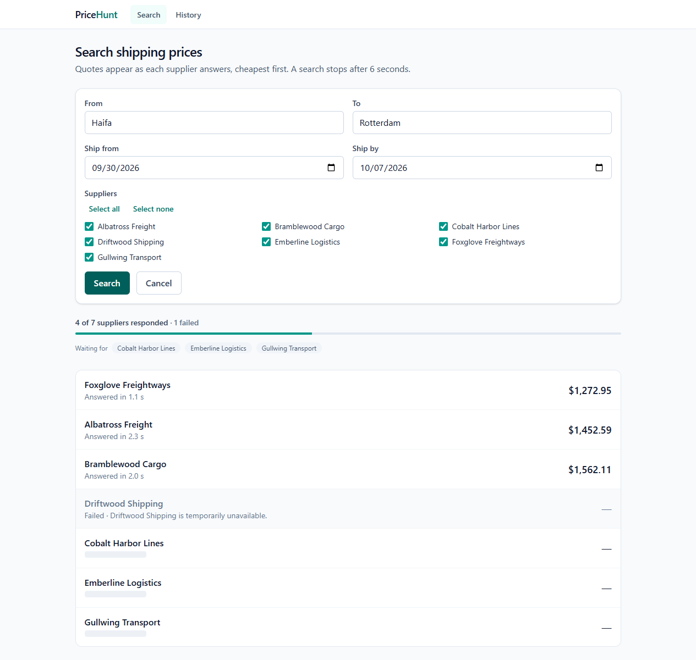
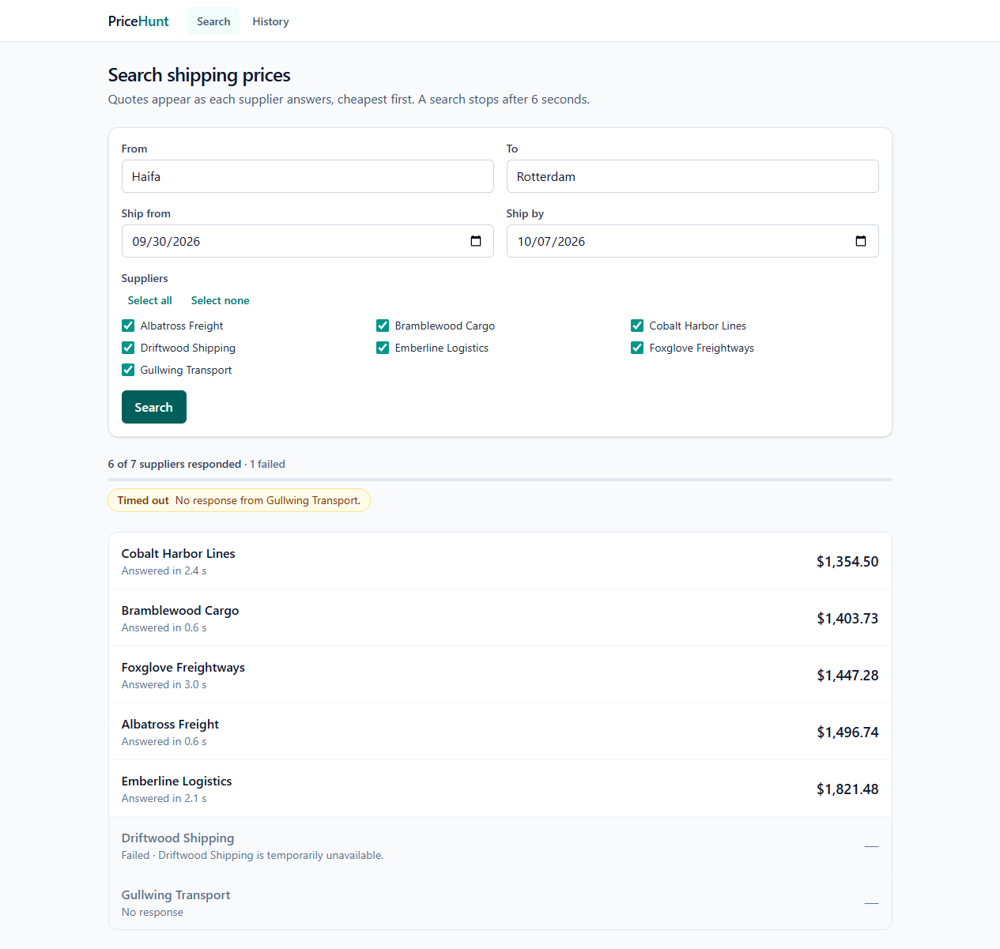
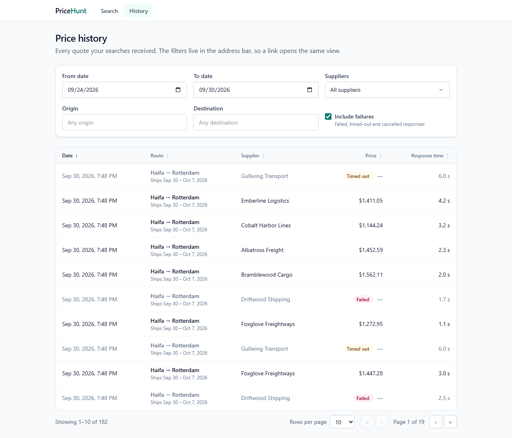
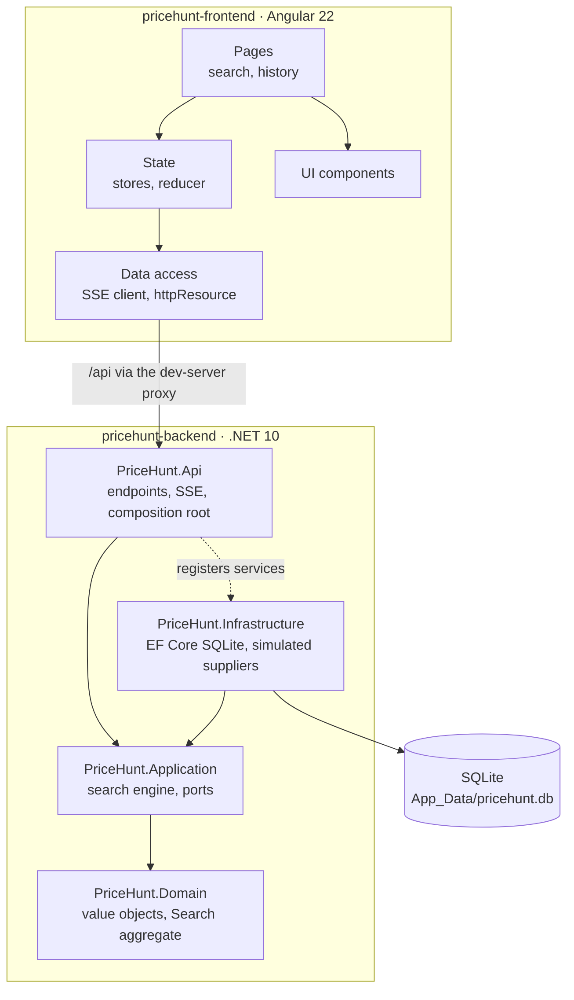
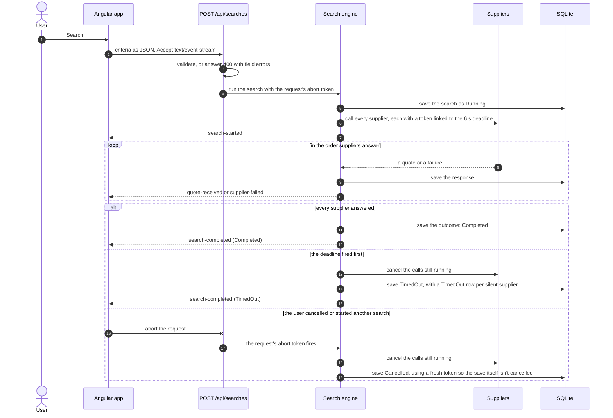
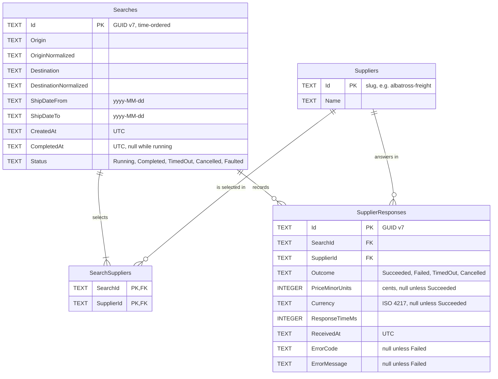

# PriceHunt

PriceHunt searches shipping prices across seven simulated suppliers and shows each quote the moment it arrives.

- A **.NET 10 API** queries every selected supplier at once and streams each outcome to the browser over **Server-Sent Events**. A search stops after **6 seconds**, and cancelling it (or starting another) cancels every supplier call still running.
- An **Angular 22 app** keeps the list sorted cheapest first while quotes arrive, without flicker: rows keep their DOM nodes and glide to their new place.
- Every search and every supplier response, failures included, is stored in **SQLite** through EF Core, and the **history screen** filters, sorts and pages it on the server.

| Live search, quotes still arriving | Finished search | History |
| --- | --- | --- |
|  |  |  |

**Contents:** [Overview](#1-overview) · [Getting started](#2-getting-started) · [Tests](#3-tests) · [Architecture](#4-architecture) · [Streaming](#5-streaming-how-and-why) · [Database](#6-database) · [API](#7-api-reference) · [Decisions](#8-design-decisions-and-trade-offs) · [Assumptions](#9-assumptions-and-interpretations) · [Next steps](#10-what-i-would-do-differently) · [AI usage](#11-ai-usage)

## 1. Overview

The assignment ([brief](docs/brief/PriceHunt_Home_Assignment.md)) asks for a price search across suppliers that are slow, sometimes fail and sometimes never answer. The interesting parts are all about time:

- **Streaming.** Results must reach the user as each supplier answers, not when the slowest one does.
- **A deadline.** No search may run longer than 6 seconds; what has arrived by then is the answer.
- **Cancellation.** A new search replaces the old one, and the old one's supplier calls stop on the server too.
- **A calm screen.** The list re-sorts as prices arrive, without flicker or rows jumping about.

The seven suppliers are simulated. Five answer after a random 0.5–5 s delay, Driftwood Shipping fails about 30 % of the time, and Gullwing Transport never answers, so a search that includes it always ends at the deadline ("Timed out" is the expected outcome of the default search, not a bug).

Every requirement in the brief is mapped to its code and its tests in [the traceability matrix](docs/requirements-traceability.md).

## 2. Getting started

### Prerequisites

| Tool | Version | Notes |
| --- | --- | --- |
| .NET SDK | 10.0.100 or later | Built with 10.0.401. `run.ps1` checks the version and stops with a clear message if it's missing or too old. |
| Node.js | 22.22.3+, 24.15.0+ or 26+ | Angular 22's supported range. Built with 24.21.0 (see `.nvmrc`). npm comes with Node. |
| PowerShell | Windows PowerShell 5.1, or PowerShell 7+ | Both `run.ps1` scripts were verified on Windows PowerShell 5.1. PowerShell 7 wasn't available on the build machine. |
| Google Chrome | any current version | Only for the end-to-end tests. |

No global tools, admin rights or certificates are needed. The API runs over plain HTTP, and the Angular dev server proxies `/api` to it, so there's no CORS setup either.

### Run it

Start the API first, in its own terminal, then the web app:

```powershell
.\pricehunt-backend\run.ps1     # API on http://localhost:5080
.\pricehunt-frontend\run.ps1    # app on http://localhost:4200
```

Then open **http://localhost:4200**.

- If PowerShell refuses to run scripts (the Windows default, or files from a downloaded archive), run them through `powershell -ExecutionPolicy Bypass -File .\pricehunt-backend\run.ps1`, and the same for the frontend.
- On macOS or Linux, use `pwsh ./pricehunt-backend/run.ps1` and `pwsh ./pricehunt-frontend/run.ps1`. They resolve every path from their own folder and use no Windows-only commands, but they were only verified on Windows PowerShell 5.1.

What the scripts do:

- **Backend:** checks the .NET SDK, then runs `dotnet run --project src/PriceHunt.Api --launch-profile http`, which restores and builds as needed. The database and its schema are created on first run. It prints the URLs and passes on the API's exit code.
- **Frontend:** checks Node and npm, runs `npm ci` only when `node_modules` is missing or older than `package-lock.json`, warns (without stopping) if the API's `/health` doesn't answer yet, and starts the Angular dev server with the `/api` proxy.

### The database

- The SQLite file lives at `pricehunt-backend/src/PriceHunt.Api/App_Data/pricehunt.db`. It is created and migrated on startup, and git ignores it.
- To start again from an empty database: `.\pricehunt-backend\run.ps1 -ResetDatabase`.
- Settings (in `appsettings.json`, or as environment variables):
  - `Database__Path`: where the file goes, relative to the API folder or absolute.
  - `Simulation__Seed`: a number to make supplier delays, prices and failures reproducible.
  - `Search__MaxDuration`: the deadline, 6 seconds by default.

## 3. Tests

| Suite | Where | What it covers |
| --- | --- | --- |
| Backend, 200 tests | `pricehunt-backend/tests` | Domain rules; the search engine on fake time (deadline, cancellation, isolation); EF Core on real SQLite files; the API over `WebApplicationFactory`, reading the SSE stream event by event; architecture rules (ArchUnitNET). |
| Frontend unit, 151 tests | `pricehunt-frontend/src` (Vitest) | The SSE parser and client, the reducer and stores, the URL mapping, date conversion, and every component's rendering states. |
| End-to-end, 14 scenarios | `pricehunt-frontend/e2e` (Playwright) | Streaming order, the deadline, cancellation, validation, the history screen, API failures, axe accessibility checks and keyboard-only use, against the real API. |

**Backend** (from `pricehunt-backend`):

```powershell
dotnet build                              # warnings are errors
dotnet format --verify-no-changes         # code style
dotnet test                               # all five test projects

# Coverage for every suite, merged into one report (TestResults/coverage/report/index.html)
dotnet test --coverlet --coverlet-output-format cobertura --results-directory TestResults/coverage
dotnet tool restore
dotnet reportgenerator -reports:"TestResults/coverage/coverage.cobertura.*.xml" -targetdir:TestResults/coverage/report -reporttypes:"Html;TextSummary"

# Minimum coverage per layer (fails the run when it isn't met)
dotnet test --project tests/PriceHunt.Domain.Tests --coverlet --coverlet-include "[PriceHunt.Domain]*" --coverlet-threshold 90
dotnet test --project tests/PriceHunt.Application.Tests --coverlet --coverlet-include "[PriceHunt.Application]*" --coverlet-threshold 90
```

Line coverage at the time of writing: 98.4 % overall (Domain 99.5 %, Application 98.7 %, Infrastructure 98.4 %, API 97 %). The tests use a fake clock (`FakeTimeProvider`) and task signals instead of sleeps, so the 6-second deadline is tested without waiting 6 seconds.

**Frontend** (from `pricehunt-frontend`, after `npm ci` or a first `run.ps1`):

```powershell
npm run lint                  # ESLint: strict typed rules, Angular rules, layering rules
npm run format:check          # Prettier
npm test                      # unit tests
npm run test:coverage         # unit tests with coverage (80 % minimum), report in coverage/
npm run build                 # production build

npm run e2e                   # end-to-end tests
npx playwright test --repeat-each=3
```

The end-to-end suite starts its own API (port 5081, Release build, seeded simulator, a new database file for each run) and dev server (port 4201). So it neither uses nor disturbs a copy you have running on the usual ports. It uses the installed Google Chrome. Without Chrome, run `npx playwright install chromium` and remove `channel: 'chrome'` from `playwright.config.ts`. The scenarios measure the real deadline, so they run one at a time and take about a minute.

## 4. Architecture



**Backend: Clean Architecture.** Dependencies point inward:

- **Domain** references nothing. Value objects (`Location`, `Route`, `ShippingDateRange`, `Money`, `SupplierId`) validate themselves, and the `Search` aggregate enforces the rules: each selected supplier answers once, and a search ends exactly once.
- **Application** holds the search engine and the ports it needs (`IShippingSupplier`, `ISearchRepository`, `IPriceHistoryQuery`). It knows no EF Core and no ASP.NET Core.
- **Infrastructure** implements the ports: EF Core with SQLite, and the simulated suppliers.
- **Api** is the composition root and the only layer that knows HTTP. It touches Infrastructure only to register services.

Architecture tests enforce these rules, so a violation fails the build's test run. The build treats warnings as errors, with the recommended .NET analyzers and code style enforced.

**Frontend: the same idea, per feature.** Each feature (`search`, `history`) has `domain/` (pure TypeScript), `data-access/` (HTTP and SSE), `state/` (stores) and `ui/` (presentational components), plus a page that wires them together. Shared code lives in `core/` and `shared/`. ESLint enforces the layering: features never import each other, domain code imports neither Angular nor RxJS, and components never call `HttpClient` or `fetch`. Everything is standalone, zoneless, signal-based and `OnPush`, with strict TypeScript and no `any`.

## 5. Streaming: how and why

**Server-Sent Events over `POST /api/searches`.** One request is one search: the response stays open while suppliers answer, one event per outcome, and closes after the final event. The full reasoning is in [ADR-001](docs/adr/ADR-001-streaming-transport.md).

Why SSE, and not something else:

| Option | Why not |
| --- | --- |
| Native `EventSource` | GET only, so the criteria would go in the URL; no custom headers; it reconnects on its own, which would silently re-run a search; it can't read a `400` validation response. |
| SignalR | A two-way hub, connection state, groups and a client library, for a one-way stream that lasts six seconds. |
| WebSockets | A custom message protocol, no HTTP status codes or validation responses, and upgrade support needed in every proxy. |
| Newline-delimited JSON | Works, but has no standard framing for event names and ids, and no standard parser. |
| Polling | Several requests per search, state kept between them on the server, and added latency on every result. |

With SSE, a bad request is a normal `400` with field errors, streaming is plain HTTP that proxies pass through, .NET 10 has first-class support (`TypedResults.ServerSentEvents`), and closing the request is the cancellation signal. The browser side is `fetch` with a streamed body and a small parser that follows the SSE specification (about 90 lines, fully tested), exposed as an RxJS `Observable`.

**The event contract:**

| Event | When | Payload (besides `searchId`) |
| --- | --- | --- |
| `search-started` | Always first | `suppliers` (id, name), `startedAt`, `deadline`, `maxDurationMs` |
| `quote-received` | A supplier returned a price | `supplierId`, `price { amount, currency }`, `responseTimeMs`, `receivedAt` |
| `supplier-failed` | A supplier returned an error | `supplierId`, `errorCode`, `errorMessage`, `responseTimeMs`, `receivedAt` |
| `search-completed` | Always last, exactly once | `status` (`Completed`, `TimedOut` or `Faulted`), `completedAt`, `respondedCount`, `succeededCount`, `failedCount`, `noResponseSupplierIds` |

Payloads are camelCase JSON with UTC timestamps, and every event carries an increasing `id`. A cancelled search sends nothing more, because nobody is listening.

**Deadline and cancellation:**



The details that make this reliable are in [ADR-002](docs/adr/ADR-002-search-lifecycle.md):

- **Each supplier call is isolated.** A wrapper turns any exception into a failure result, so one broken supplier never affects another.
- **The deadline doesn't depend on suppliers behaving.** Each call is also guarded with `WaitAsync`, so a supplier that ignores cancellation can't hold the search past the deadline.
- **Nothing is lost.** Every response is saved before its event is sent, and the final outcome is saved on its own timeout token.
- **On the client,** `switchMap` aborts the previous request when a new search starts, and the reducer ignores anything from an older search.

## 6. Database

EF Core with SQLite. The schema comes from the committed migration, applied automatically at startup, and the database runs in write-ahead-log mode. The full reasoning is in [ADR-003](docs/adr/ADR-003-persistence-model.md).



**`Searches`**

| Column | Type | Null | Notes |
| --- | --- | --- | --- |
| `Id` | TEXT | no | Primary key. A GUID v7, so keys sort by creation time. |
| `Origin`, `Destination` | TEXT (100) | no | As the user typed them, trimmed. |
| `OriginNormalized`, `DestinationNormalized` | TEXT (100) | no | Upper-case copies for case-insensitive filtering. Indexed. |
| `ShipDateFrom`, `ShipDateTo` | TEXT | no | Calendar dates, `yyyy-MM-dd`. |
| `CreatedAt` | TEXT | no | UTC. |
| `CompletedAt` | TEXT | yes | UTC; null while the search runs. |
| `Status` | TEXT (16) | no | `Running`, `Completed`, `TimedOut`, `Cancelled` or `Faulted`. Indexed, so searches a crash left running can be closed at startup. |

**`SearchSuppliers`**: the suppliers selected for each search. Composite primary key (`SearchId`, `SupplierId`). Rows are deleted with their search; a supplier with searches can't be deleted. Indexed on `SupplierId`.

**`SupplierResponses`**

| Column | Type | Null | Notes |
| --- | --- | --- | --- |
| `Id` | TEXT | no | Primary key, GUID v7. |
| `SearchId` | TEXT | no | Foreign key to `Searches`; deleted with the search. |
| `SupplierId` | TEXT (64) | no | Foreign key to `Suppliers`. |
| `Outcome` | TEXT (16) | no | `Succeeded`, `Failed`, `TimedOut` or `Cancelled`. |
| `PriceMinorUnits` | INTEGER | yes | The price in cents; null unless the supplier quoted. Indexed for price sorting. |
| `Currency` | TEXT (3) | yes | ISO 4217, e.g. `USD`. |
| `ResponseTimeMs` | INTEGER | no | How long the supplier took, or how long the search waited. Indexed. |
| `ReceivedAt` | TEXT | no | UTC. Indexed. |
| `ErrorCode` | TEXT (64) | yes | For failures, e.g. `supplier_unavailable`. |
| `ErrorMessage` | TEXT (500) | yes | For failures. |

Indexes on `SupplierResponses` cover every history filter and sort: `ReceivedAt`, (`Outcome`, `ReceivedAt`), (`SupplierId`, `ReceivedAt`), `PriceMinorUnits` and `ResponseTimeMs`. A **unique** index on (`SearchId`, `SupplierId`) guarantees one outcome per supplier per search.

**`Suppliers`** (`Id` slug primary key, `Name` indexed) is synchronised from configuration at startup.

**SQLite type choices.** SQLite has no native GUID, date, decimal or enum types.

- GUIDs, dates and UTC timestamps are stored as ISO text, which sorts correctly, and are read back as UTC.
- Money is an integer number of cents, so prices sort exactly and never suffer from floating-point rounding.
- Enums are stored as their names, so the data reads well in any SQLite browser.

**What changed from the suggested shape, and why:**

- A `Suppliers` table, so responses and selections have real foreign keys and the history can sort by supplier name.
- Upper-cased copies of the origin and destination, because SQLite's case-insensitive comparison only folds ASCII letters.
- The unique index on (`SearchId`, `SupplierId`), which turns "one outcome per supplier" from a code rule into a database guarantee.
- Prices in minor units rather than a decimal column.

## 7. API reference

The API listens on `http://localhost:5080`. The web app reaches it through the dev server as `/api/...`. The OpenAPI document is at `/openapi/v1.json` in Development.

**`GET /health`**: `Healthy` when the API is up.

**`GET /api/suppliers`**: the seven suppliers, `[{ "id": "albatross-freight", "name": "Albatross Freight" }, ...]`.

**`POST /api/searches`**: runs a search and streams its events.

| Field | Type | Required | Rules |
| --- | --- | --- | --- |
| `origin`, `destination` | string | yes | 1–100 characters after trimming; must differ, ignoring case. |
| `fromDate`, `toDate` | `yyyy-MM-dd` | yes | `toDate` can't be before `fromDate`. |
| `supplierIds` | string array | no | Missing or empty means every supplier; unknown ids are rejected. |

In Windows PowerShell, write the body to a file first, because PowerShell 5.1 strips the quotes from JSON passed on the command line:

```powershell
'{"origin":"Haifa","destination":"Rotterdam","fromDate":"2026-10-01","toDate":"2026-10-08"}' | Set-Content -Encoding ascii search.json
curl.exe -N -X POST http://localhost:5080/api/searches -H "Content-Type: application/json" --data-binary "@search.json"
```

In bash:

```bash
curl -N -X POST http://localhost:5080/api/searches -H 'Content-Type: application/json' \
  -d '{"origin":"Haifa","destination":"Rotterdam","fromDate":"2026-10-01","toDate":"2026-10-08"}'
```

`-N` turns off curl's buffering, so each event prints as it arrives. A real run, shortened:

```text
event: search-started
data: {"suppliers":[{"id":"albatross-freight","name":"Albatross Freight"},…],"startedAt":"2026-09-30T16:58:04.3029403Z","deadline":"2026-09-30T16:58:10.3029403Z","maxDurationMs":6000,"searchId":"01a0f340-7a8e-70cc-bed4-fe802ed17e81"}
id: 1

event: quote-received
data: {"supplierId":"emberline-logistics","price":{"amount":1895.71,"currency":"USD"},"responseTimeMs":1570,"receivedAt":"2026-09-30T16:58:05.9987945Z","searchId":"01a0f340-7a8e-70cc-bed4-fe802ed17e81"}
id: 2

…

event: search-completed
data: {"status":"TimedOut","completedAt":"2026-09-30T16:58:10.3099595Z","respondedCount":6,"succeededCount":6,"failedCount":0,"noResponseSupplierIds":["gullwing-transport"],"searchId":"01a0f340-7a8e-70cc-bed4-fe802ed17e81"}
id: 8
```

Invalid input gets a `400` before any streaming starts, as a [problem details](https://www.rfc-editor.org/rfc/rfc9457) response (`application/problem+json`) with an error per field:

```json
{
  "type": "https://tools.ietf.org/html/rfc9110#section-15.5.1",
  "title": "One or more validation errors occurred.",
  "status": 400,
  "errors": { "destination": ["The destination must differ from the origin."] },
  "traceId": "00-5944c114bc6de4c638b4c2aeee12075b-2190f7b9462c8ff5-00"
}
```

**`GET /api/history`**: supplier responses, filtered, sorted and paged by the database.

| Parameter | Default | Meaning |
| --- | --- | --- |
| `startDate`, `endDate` | none | ISO-8601 instants; returns responses with `startDate ≤ receivedAt < endDate`. |
| `suppliers` | all | Repeat for several: `?suppliers=albatross-freight&suppliers=cobalt-harbor-lines`. |
| `origin`, `destination` | none | Case-insensitive "contains" match. |
| `includeFailures` | `false` | Also return failed, timed-out and cancelled responses. |
| `sortBy` | `date` | `date`, `route`, `supplier`, `price` or `responseTime`. |
| `sortDirection` | `desc` | `asc` or `desc`. Responses without a price always sort last. |
| `page`, `pageSize` | `1`, `20` | `pageSize` is at most 100. |

```powershell
curl.exe "http://localhost:5080/api/history?suppliers=albatross-freight&sortBy=price&sortDirection=asc&pageSize=5"
```

The answer is `{ "items": [...], "page": 1, "pageSize": 5, "totalCount": 1 }`. Each item has `id`, `searchId`, `receivedAt`, `origin`, `destination`, `shipDateFrom`, `shipDateTo`, `supplierId`, `supplierName`, `outcome`, `price` (or null), `responseTimeMs` and `errorCode`.

## 8. Design decisions and trade-offs

The significant decisions have their own records:

- [ADR-001: Streaming transport](docs/adr/ADR-001-streaming-transport.md). SSE over `POST`, compared with SignalR, WebSockets, `EventSource`, polling and gRPC-Web.
- [ADR-002: Search lifecycle](docs/adr/ADR-002-search-lifecycle.md). The deadline, cancellation, supplier isolation and exactly one final event.
- [ADR-003: Persistence model](docs/adr/ADR-003-persistence-model.md). The schema, its improvements and its indexes.
- [ADR-004: Frontend state and ordering](docs/adr/ADR-004-frontend-state-and-ordering.md). The store, the three-layer stale-event guard, and how the list re-sorts without flicker or layout shift.

Smaller calls, with the alternatives and the reasons, are in the [decision log](docs/decision-log.md). The ones a reviewer is most likely to ask about:

- **Rows are sorted in the DOM and moved by `transform`.** Screen readers and tests see the same order as the eye. Rows are absolutely positioned at `translateY(rank × row height)` and glide with additive Web Animations, so re-sorting never triggers layout. Performance traces measured a layout shift of 0.01 during a search, all of it from the pending-supplier chips closing up.
- **Every search is persisted, including cancelled ones.** Their unanswered suppliers are recorded as `Cancelled`, and a deadline records them as `TimedOut`, so the history tells the whole story.
- **The history's URL is its state.** Filters, sort and page live in the query string, so links can be shared and back, forward and reload restore the view.
- **One validator.** The API validates in one place (the application's `SearchPlanner`), and the form applies the same rules with the same messages.
- **Hand-written test fakes and a fake clock** instead of mocking libraries and sleeps. The deadline tests are exact and fast.
- **Only permissively licensed packages ship.** The one exception is `@axe-core/playwright` (MPL-2.0), which the brief asks for; it's a test-only dependency.

## 9. Assumptions and interpretations

- **History dates filter on when a quote was received,** not on the shipping dates. The screen's local calendar days become a half-open range of UTC instants: local midnight on the first day to local midnight after the last.
- **A supplier still pending at the deadline is recorded as `TimedOut`,** and one pending when the search is cancelled is recorded as `Cancelled`. Both count as recorded failures for the requirement to store every response.
- **"Responded" counts both prices and failures,** and the suppliers that never answered are named separately ("No response from Gullwing Transport").
- **The "two projects" are `pricehunt-backend`** (the .NET solution with its layer projects) **and `pricehunt-frontend`** (the Angular app). "One command" is each folder's `run.ps1`.
- **`Faulted`** is an extra final status, beyond the three the brief names, for an unexpected server error after streaming has started, when the HTTP status can no longer change.
- **In the history, choosing no supplier means every supplier,** matching the API. The default view is the last 7 days, newest first, with failures hidden until "Include failures" is ticked.
- **Prices are in US dollars,** as the simulated suppliers quote them. The model and database store the currency with every price.

## 10. What I would do differently

With more time, or for production:

- **Real supplier adapters** behind the same `IShippingSupplier` port, with timeouts, retries only where a call is safe to repeat, and circuit breakers.
- **OpenTelemetry** traces and metrics: a span per supplier call, and histograms of response times and outcomes per supplier.
- **PostgreSQL** for concurrent writers, and **keyset pagination** on (`ReceivedAt`, `Id`) instead of offsets once the history grows large.
- **Rate limiting** on searches, since each one fans out to every supplier, and **authentication**, so each user sees their own history.
- **Containers and CI**: build, the three test suites and the end-to-end suite on every push, with published coverage.
- **Internationalisation** of text, dates and currencies.

**Known limitations:**

- The pending-supplier chips slide left as each supplier answers: a very small layout shift (about 0.008), measured with the list itself standing still.
- On a narrow screen, chips that don't fit fade out at the edge instead of wrapping.
- In the browser's developer tools, every streamed search request shows as `net::ERR_ABORTED`, even one that finished normally. Chrome reports any `fetch` whose body is read as a stream that way, so the end-to-end tests check the abort signal and the end of the body instead.
- The scripts were verified on Windows PowerShell 5.1 only.

## 11. AI usage

This project was built with an AI coding agent, working from the implementation brief in phases, each ending with automated checks and a commit.

| Tool | Used for | How the output was checked |
| --- | --- | --- |
| **Claude Code** (Claude Opus 5.5) | Planning the phases; writing the code, tests, scripts and documents; diagnosing failures | Tests written before or alongside the code; every phase gate ran the build with warnings as errors, format and lint checks, all test suites and coverage thresholds; key tests were mutation-checked (the code was broken on purpose to see the test fail). |
| **Playwright MCP** | Driving the running app in a real browser: progressive arrival, sort order during a search, DOM identity during re-sorts, reduced motion, keyboard use, history filters and URL restoration, screenshots | In-page probes (DOM observers, timestamps, request logs) whose numbers are recorded in the logs below. |
| **Chrome DevTools MCP** | Network and console checks, cancellation evidence, performance traces (layout shift, long tasks), CPU and network throttling, Lighthouse, phone width | Trace insights, Lighthouse scores and request details, compared before and after each fix. |

The browser checks found real problems that the unit tests had missed, and each was fixed and re-measured:

- The results list moved during a search (layout shift 0.18, now 0.01).
- The history page shifted on load (0.57, now 0.003).
- Hidden labels widened the page at phone width.
- The date spinner could put the year 275759 into the URL.
- Focus was lost after choosing a supplier with the mouse.
- Angular logged a warning when a new search replaced the pending chips.

They also caught flaws in the agent's own tests, which were fixed rather than weakened. One end-to-end read mixed an old order with new text, and one read the history table before its new request had started.

Every step is in the [AI usage log](docs/ai-usage-log.md), and every decision in the [decision log](docs/decision-log.md).

> **Candidate's review notes**
>
> _To be written by the candidate: what I reviewed, changed or would do differently from the AI's output._
